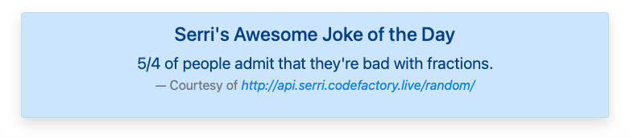

# API Exercises

## Exercise 1
This exercise is a news website based on RSS feeds with technology news from BBC http://feeds.bbci.co.uk/news/technology/rss.xml and CNN http://rss.cnn.com/rss/edition_technology.rss

<kbd></kbd>

## Exercise 2
Serri has provided a jokes API http://api.serri.codefactory.live/random/
The joke of the day is also included at the bottom of the page.

